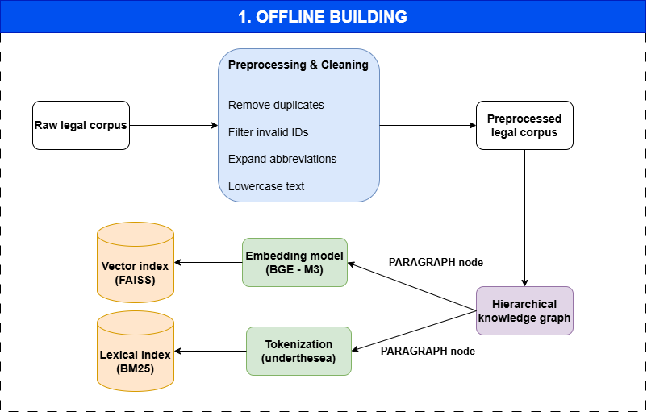
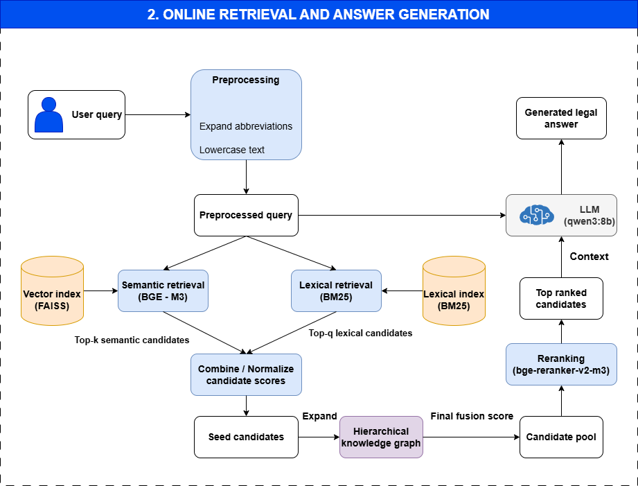
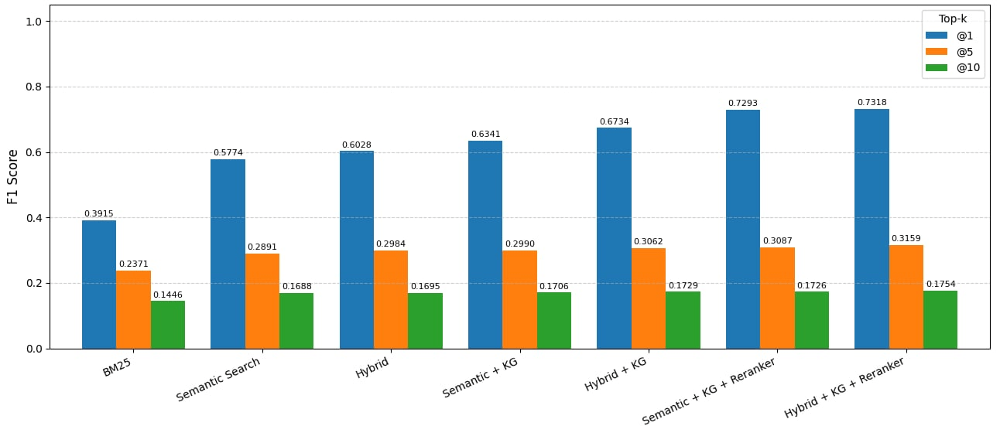
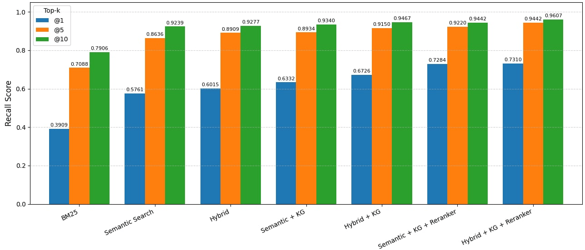

# Enhancing Retrieval for Vietnamese Legal QA Systems

This project aims to build a Vietnamese legal information retrieval system for common questions, helping users quickly and accurately find relevant legal text passages.

The dataset used in this project is [Zalo AI Legal Text Retrieval VN](https://huggingface.co/datasets/GreenNode/zalo-ai-legal-text-retrieval-vn), which supports the evaluation of legal text retrieval based on user queries.

## Offline building

In the offline stage, the system processes and normalizes legal documents, builds the knowledge graph, creates indexes to support later retrieval.

## Online retrieval

In the online stage, when a user enters a question, the system searches the pre-built repository for the most relevant documents and returns the top 5 best matching results before putting them into the LLM.

## Experimental results

Experimental results show that the system achieves strong performance on F1 and Recall for Vietnamese legal text retrieval.

